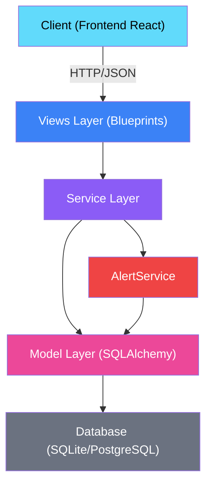
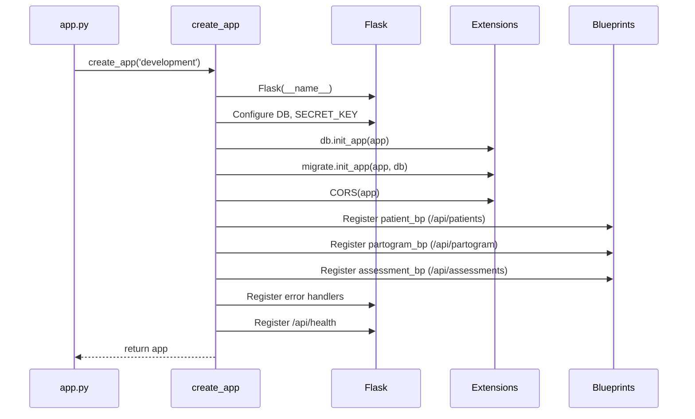
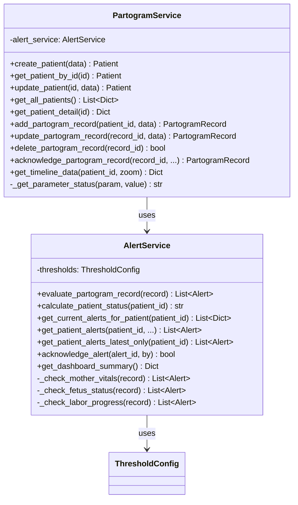
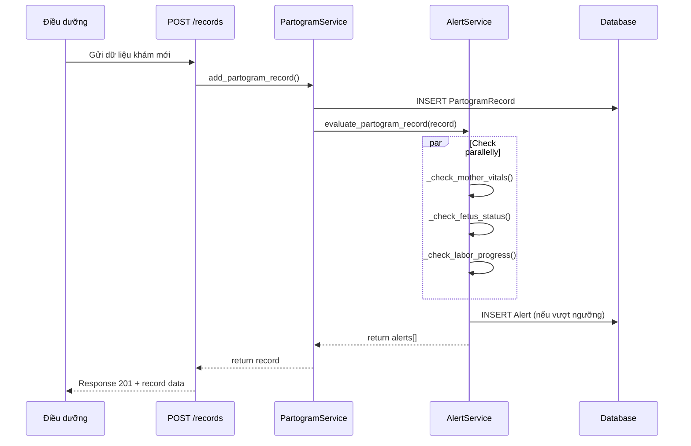
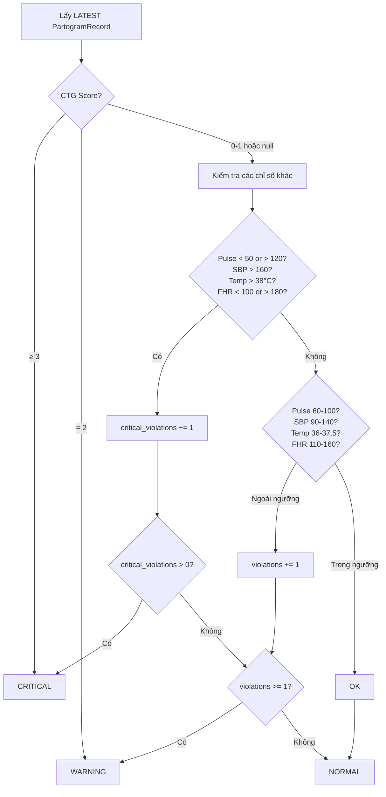
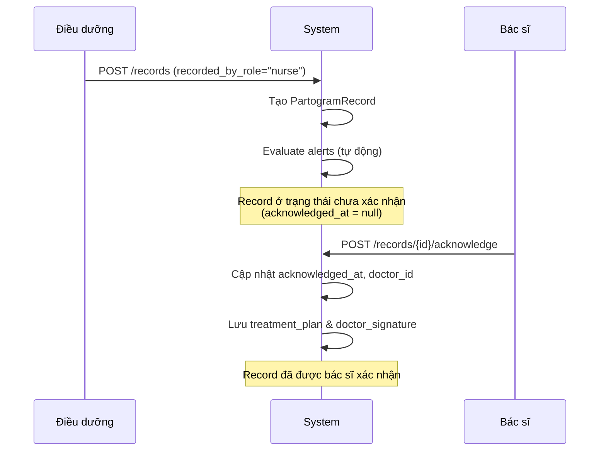

# Backend Architecture — Hệ thống Partogram Bệnh viện Hùng Vương

> Cấu trúc code, design pattern đang dùng, luồng xử lý, và cách các thành phần liên kết. Viết cho người đã biết Flask/SQLAlchemy cơ bản, cần hiểu nhanh hệ thống để sửa bug hoặc thêm feature.

---

## Mục lục

- [Tổng quan công nghệ](#tổng-quan-công-nghệ)
- [Cấu trúc thư mục](#cấu-trúc-thư-mục)
- [Kiến trúc phân lớp](#kiến-trúc-phân-lớp)
- [Application Factory Pattern](#application-factory-pattern)
- [Service Layer](#service-layer)
- [Alert System Flow](#alert-system-flow)
- [Workflow Nurse → Doctor](#workflow-nurse--doctor)
- [Các vấn đề hiện tại & đề xuất cải thiện](#các-vấn-đề-hiện-tại--đề-xuất-cải-thiện)

---

## Tổng quan công nghệ

| Thành phần | Công nghệ | Version |
|-----------|-----------|---------|
| Framework | Flask | 2.3.2 |
| ORM | SQLAlchemy | 2.0.19 |
| Migration | Flask-Migrate (Alembic) | 4.0.4 |
| CORS | Flask-CORS | 4.0.0 |
| Database (dev) | SQLite | — |
| Database (prod) | PostgreSQL (via DATABASE_URL) | — |
| WSGI Server | Gunicorn | 21.2.0 |
| Env Management | python-dotenv | 1.0.0 |

Không có framework validation (Marshmallow/Pydantic), không có background job runner (Celery/RQ), không có cache layer. Stack tối giản, hợp lý cho quy mô hiện tại nhưng sẽ là điểm nghẽn đầu tiên nếu traffic tăng — xem phần vấn đề thiết kế bên dưới.

---

## Cấu trúc thư mục

```
backend/
├── app.py                          # Entry point, CLI commands, seed data
├── manage.py                       # Flask CLI management
├── requirements.txt                # Python dependencies
├── .env / .env.example             # Environment variables
├── instance/                       # SQLite database files (gitignored)
├── migrations/                     # Alembic migration scripts
│   ├── alembic.ini
│   ├── env.py
│   ├── script.py.mako
│   └── versions/
└── app/
    ├── __init__.py                 # Application factory (create_app)
    ├── models/
    │   └── __init__.py             # All SQLAlchemy models + ThresholdConfig
    ├── services/
    │   ├── alert_service.py        # Alert evaluation & status calculation
    │   └── partogram_service.py    # Business logic cho CRUD & timeline
    └── views/
        ├── patient_views.py        # Patient & Alert endpoints
        ├── partogram_views.py      # Partogram record & chart endpoints
        └── assessment_views.py     # Assessment & Outcome endpoints
```

Tất cả model gộp chung trong một file `models/__init__.py`. Ở quy mô hiện tại (5 bảng) việc này chưa gây khó chịu, nhưng nếu thêm bảng mới nên tách file riêng theo domain (`patient.py`, `partogram.py`, ...) trước khi file này phình to khó review.

---

## Kiến trúc phân lớp



### Mô tả các lớp

| Lớp | File(s) | Trách nhiệm |
|-----|---------|-------------|
| **Views** | `views/*.py` | Nhận HTTP request, validate input tối thiểu, trả JSON response. Không nên chứa business logic — phần lớn tuân thủ, nhưng kiểm tra kỹ trước khi thêm code mới vào view. |
| **Services** | `services/*.py` | Business logic, ORM query, điều phối giữa các model. |
| **Models** | `models/__init__.py` | Schema DB, serialize/deserialize, vài helper method. |
| **Config** | `ThresholdConfig` | Ngưỡng cảnh báo y tế, hardcode trong code — không phải bảng DB. |

Ranh giới Views/Services được giữ khá nghiêm túc trong codebase này — điểm cộng thực sự, không phải nói cho có. Khi thêm endpoint mới, giữ nguyên nguyên tắc này: logic đi vào service, view chỉ parse request và format response.

---

## Application Factory Pattern

Hệ thống dùng **Application Factory** (`create_app()`) trong `app/__init__.py` — cách làm chuẩn của Flask khi cần test với config khác nhau (dev/test/prod) mà không import side-effect toàn cục.



### Blueprint Registration

| Blueprint | Prefix | File |
|-----------|--------|------|
| `patient_bp` | `/api/patients` | `views/patient_views.py` |
| `partogram_bp` | `/api/partogram` | `views/partogram_views.py` |
| `assessment_bp` | `/api/assessments` | `views/assessment_views.py` |

---

## Service Layer

### PartogramService

Chịu trách nhiệm chính cho business logic:



### Mối quan hệ giữa các Service

- `PartogramService` sở hữu một instance `AlertService` — composition, không phải dependency injection.
- Mỗi lần tạo `PartogramRecord` mới, `AlertService.evaluate_partogram_record()` chạy tự động trong cùng request — không phải job async, nên nếu logic đánh giá chậm, nó chặn luôn response của client.
- Mỗi lần update record, alert được re-evaluate lại từ đầu (không diff, không incremental).

---

## Alert System Flow

### Luồng sinh Alert tự động



Toàn bộ chuỗi này chạy đồng bộ trong 1 transaction HTTP. Nếu `_check_*` throw exception, cả request `POST /records` fail theo — kể cả khi INSERT record đã thành công trước đó. Kiểm tra kỹ transaction boundary nếu bạn định thêm rule đánh giá mới có thể raise lỗi runtime (VD: division by zero khi tính tốc độ mở CTC).

### Logic đánh giá Status



### Điểm cần nhớ khi đụng vào phần này

Status chỉ dựa trên record **mới nhất**, không tích lũy lịch sử. Đây là quyết định thiết kế có chủ đích — khi chỉ số quay về bình thường, status bệnh nhân cập nhật ngay, không bị "dính" trạng thái cũ. Hợp lý cho theo dõi lâm sàng real-time, nhưng cũng có nghĩa là **dashboard không phản ánh xu hướng** (trend) — một bệnh nhân dao động normal/critical liên tục sẽ trông như đang ổn định nếu record cuối cùng tình cờ là normal. Nếu cần cảnh báo theo xu hướng, đây là chỗ phải thiết kế lại, không phải patch nhỏ.

---

## Workflow Nurse → Doctor



### Trạng thái Record

| Trường | Giá trị | Ý nghĩa |
|--------|---------|---------|
| `recorded_by_role` | `"nurse"` | Điều dưỡng nhập dữ liệu |
| `acknowledged_at` | `null` | Chưa được bác sĩ xác nhận |
| `acknowledged_at` | `datetime` | Đã xác nhận bởi bác sĩ |
| `doctor_signature` | `base64 string` | Chữ ký điện tử bác sĩ |

Workflow này chỉ tồn tại ở mức dữ liệu (field `acknowledged_at`, `doctor_id`) — không có gì ngăn một request tự xưng `recorded_by_role: "doctor"` bỏ qua bước "chờ xác nhận". Nói cách khác, quy trình nurse→doctor là convention của client, không phải constraint được backend enforce.

---

## Các vấn đề hiện tại & đề xuất cải thiện

### Bug đã xác nhận

| # | File | Dòng | Mô tả |
|---|------|------|-------|
| 1 | `partogram_views.py` | 219 | `partogram_service.alert_service.alert_service.datetime` — attribute chain lặp, crash `AttributeError` khi gọi `/export`. Fix 1 dòng, chưa ai làm. |

### Vấn đề thiết kế — theo mức độ ưu tiên nên xử lý

| # | Vấn đề | Vì sao đáng lo | Đề xuất |
|---|--------|----------------|---------|
| 1 | Không có Authentication | Bất kỳ ai có network access đều đọc/ghi được dữ liệu bệnh nhân. Với hệ thống y tế, đây là gap nghiêm trọng nhất, ưu tiên số 1 trước khi go-live thật. | JWT hoặc session-based auth, tối thiểu là API key cho service-to-service |
| 2 | `acknowledged_by` / `doctor_id` là free-text | Không xác thực danh tính người ký — audit trail vô nghĩa nếu ai cũng tự khai tên. | Gắn với user record thật, lấy từ session, không nhận từ body |
| 3 | Service instantiation ở module level | `PartogramService()`/`AlertService()` tạo 1 lần khi import module views, không theo request context. Chưa gây lỗi rõ ràng hiện tại nhưng là smell nếu sau này service cần state theo request (DB session riêng, request-scoped cache). | Factory pattern hoặc tạo trong request context |
| 4 | `ThresholdConfig` hardcode | Muốn đổi ngưỡng cảnh báo (VD: theo protocol mới của khoa) phải sửa code, deploy lại. Với ngưỡng y tế có thể thay đổi theo hướng dẫn chuyên môn, đây là ma sát không cần thiết. | Chuyển sang bảng DB có version, hoặc ít nhất là file config tách riêng khỏi code |
| 5 | Duplicate data giữa `PartogramRecord` và `Assessment` | `nurse_assessment`/`doctor_assessment`/`treatment_plan` tồn tại ở cả hai bảng, không có ràng buộc đồng bộ. Dễ dẫn đến hai nguồn "sự thật" lệch nhau. | Normalize về một nơi, hoặc document rõ use case nào dùng bảng nào và tại sao |
| 6 | Response vừa flat vừa nested | `PartogramRecord.to_dict()` trả cả flat field (`vas_score` ở root) và nested structure (`supportive_care.vas_score`, `supportive_care.vas`). Client phải biết cả hai đường để không bị miss data. | Chọn một format, migrate client theo, bỏ format còn lại |
| 7 | Không phân trang | `get_all_patients()` load tất cả không giới hạn. Chưa vỡ ở quy mô hiện tại, sẽ vỡ khi số bệnh nhân tăng. | Thêm `?page=1&per_page=20`, đừng đợi đến khi chậm mới làm |
| 8 | Validation chỉ check field bắt buộc | Không check type/range (`age` có thể âm, `ctg_score` có thể ngoài 0-3). Dữ liệu bẩn sẽ lọt vào DB và làm sai logic alert. | Marshmallow hoặc Pydantic ở tầng view |
| 9 | `SECRET_KEY` mặc định không an toàn | `dev-secret-key-hungvuong-2025` là giá trị fallback trong code — nếu quên set env var ở production, key này lộ công khai trong source. | Bắt buộc fail-fast nếu `SECRET_KEY` không được set qua env var khi `FLASK_ENV=production` |

### Tính năng chưa hoàn thiện

| Tính năng | Trạng thái | File |
|-----------|-----------|------|
| CSV Export | TODO | `partogram_views.py:213` |
| PDF Export | TODO | `partogram_views.py:213` |
| Diastolic BP alerts | Chưa implement | `alert_service.py` — threshold đã định nghĩa nhưng chưa có code check |

---

## Environment Variables

| Variable | Required | Default | Mô tả |
|----------|----------|---------|-------|
| `FLASK_APP` | ✅ | `app.py` | Entry point |
| `FLASK_ENV` | ❌ | `development` | `development` hoặc `production` |
| `FLASK_DEBUG` | ❌ | `1` | Debug mode |
| `DATABASE_URL` | ❌ (prod) | `sqlite:///partogram.db` | Connection string |
| `SECRET_KEY` | ✅ (prod) | `dev-secret-key-...` | Flask secret key |
| `CORS_ORIGINS` | ❌ | `*` (trong code) | Allowed origins |
| `LOG_LEVEL` | ❌ | `INFO` | Mức log |
| `TIMEZONE` | ❌ | `Asia/Ho_Chi_Minh` | Timezone |

---

## CLI Commands

```bash
# Initialize database
flask init-db

# Seed sample data
flask seed-db

# Run development server
python app.py
# hoặc
flask run --host=0.0.0.0 --port=5000

# Database migrations
flask db init      # Khởi tạo migration (lần đầu)
flask db migrate   # Tạo migration script
flask db upgrade   # Apply migration
```
