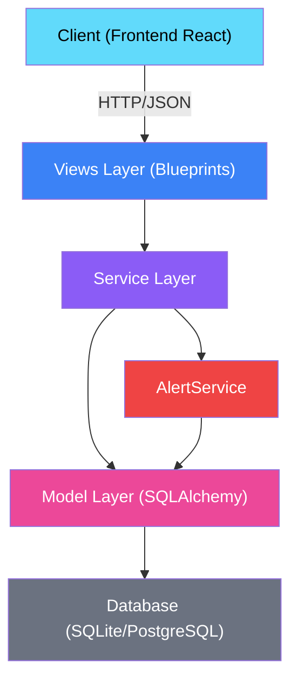
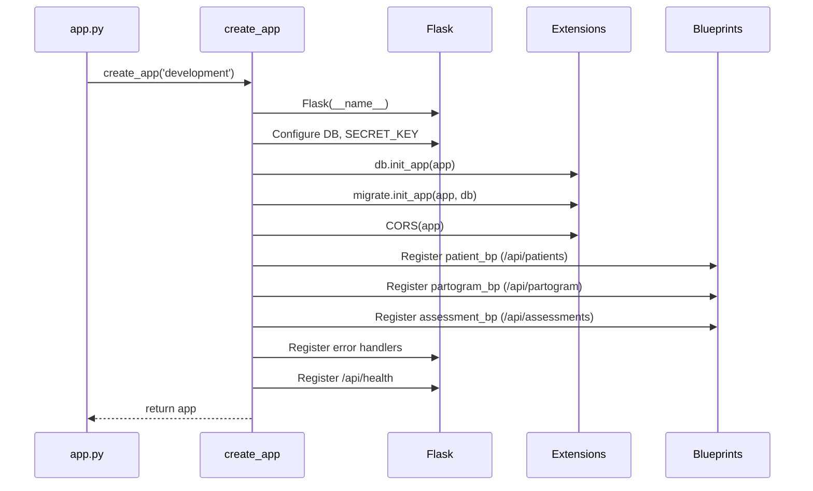
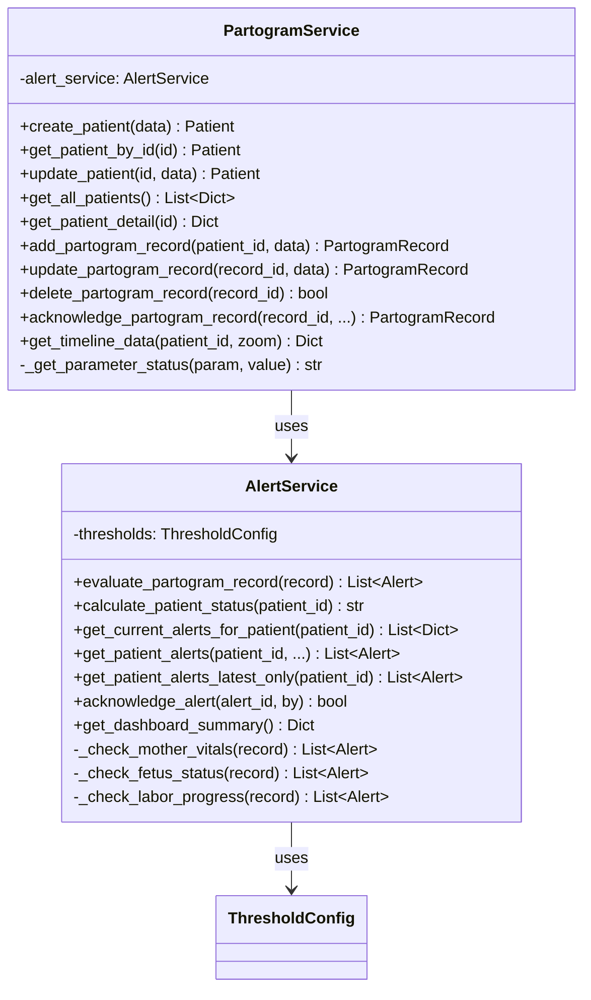
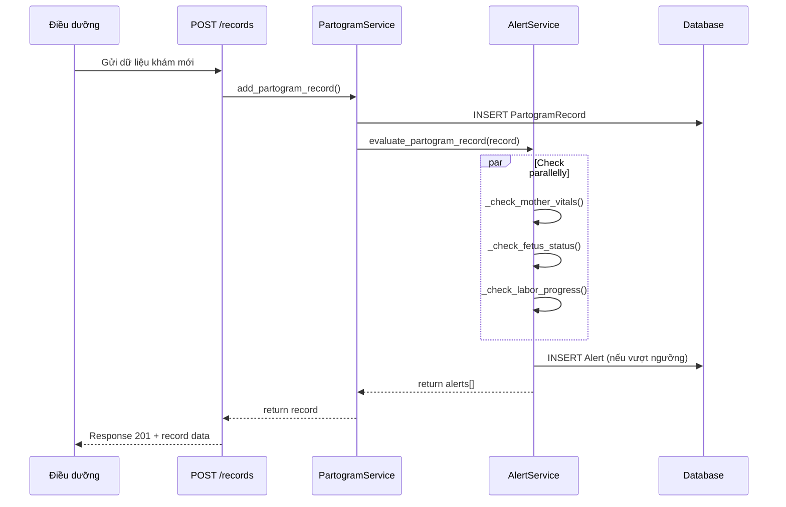
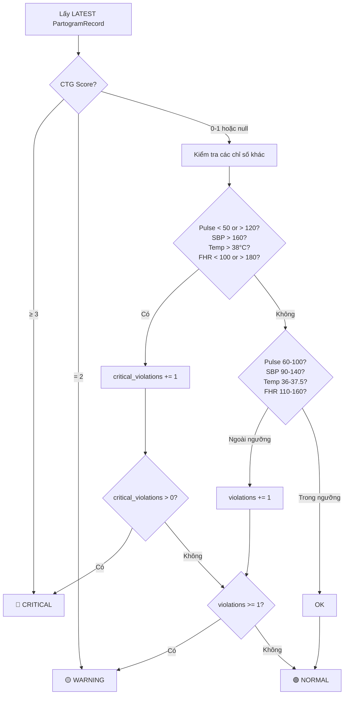
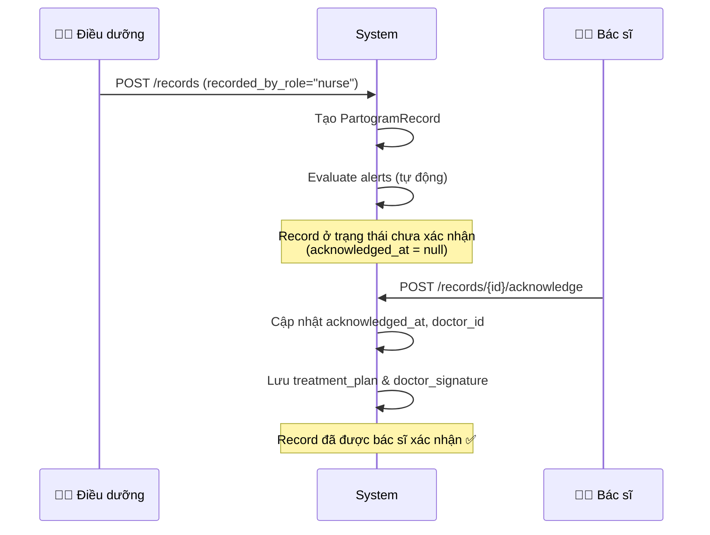

# 🏗️ Backend Architecture - Hệ thống Partogram Bệnh viện Hùng Vương

> Tài liệu kiến trúc backend, mô tả cấu trúc code, design patterns, luồng xử lý và cách các thành phần liên kết với nhau.

---

## Mục lục

- [Tổng quan công nghệ](#tổng-quan-công-nghệ)
- [Cấu trúc thư mục](#cấu-trúc-thư-mục)
- [Kiến trúc phân lớp](#kiến-trúc-phân-lớp)
- [Application Factory Pattern](#application-factory-pattern)
- [Service Layer](#service-layer)
- [Alert System Flow](#alert-system-flow)
- [Workflow Nurse → Doctor](#workflow-nurse--doctor)
- [Các vấn đề hiện tại & đề xuất cải thiện](#các-vấn-đề-hiện-tại--đề-xuất-cải-thiện)

---

## Tổng quan công nghệ

| Thành phần | Công nghệ | Version |
|-----------|-----------|---------|
| Framework | Flask | 2.3.2 |
| ORM | SQLAlchemy | 2.0.19 |
| Migration | Flask-Migrate (Alembic) | 4.0.4 |
| CORS | Flask-CORS | 4.0.0 |
| Database (dev) | SQLite | — |
| Database (prod) | PostgreSQL (via DATABASE_URL) | — |
| WSGI Server | Gunicorn | 21.2.0 |
| Env Management | python-dotenv | 1.0.0 |

---

## Cấu trúc thư mục

```
backend/
├── app.py                          # Entry point, CLI commands, seed data
├── manage.py                       # Flask CLI management
├── requirements.txt                # Python dependencies
├── .env / .env.example             # Environment variables
├── instance/                       # SQLite database files (gitignored)
├── migrations/                     # Alembic migration scripts
│   ├── alembic.ini
│   ├── env.py
│   ├── script.py.mako
│   └── versions/
└── app/
    ├── __init__.py                 # Application factory (create_app)
    ├── models/
    │   └── __init__.py             # All SQLAlchemy models + ThresholdConfig
    ├── services/
    │   ├── alert_service.py        # Alert evaluation & status calculation
    │   └── partogram_service.py    # Business logic cho CRUD & timeline
    └── views/
        ├── patient_views.py        # Patient & Alert endpoints
        ├── partogram_views.py      # Partogram record & chart endpoints
        └── assessment_views.py     # Assessment & Outcome endpoints
```

---

## Kiến trúc phân lớp



### Mô tả các lớp

| Lớp | File(s) | Trách nhiệm |
|-----|---------|-------------|
| **Views** | `views/*.py` | Nhận HTTP request, validate input, trả JSON response. Không chứa business logic. |
| **Services** | `services/*.py` | Xử lý business logic, gọi ORM queries, điều phối giữa các model. |
| **Models** | `models/__init__.py` | Định nghĩa schema DB, serialize/deserialize, helper methods. |
| **Config** | `ThresholdConfig` | Cấu hình ngưỡng y tế (hardcoded). |

---

## Application Factory Pattern

Hệ thống sử dụng **Application Factory** (`create_app()`) trong `app/__init__.py`:



### Blueprint Registration

| Blueprint | Prefix | File |
|-----------|--------|------|
| `patient_bp` | `/api/patients` | `views/patient_views.py` |
| `partogram_bp` | `/api/partogram` | `views/partogram_views.py` |
| `assessment_bp` | `/api/assessments` | `views/assessment_views.py` |

---

## Service Layer

### PartogramService

Chịu trách nhiệm chính cho tất cả business logic:



### Mối quan hệ giữa Services

- `PartogramService` **sở hữu** một instance `AlertService`
- Mỗi lần tạo `PartogramRecord` mới → `AlertService.evaluate_partogram_record()` được gọi tự động
- Mỗi lần cập nhật record → alerts được **re-evaluate**

---

## Alert System Flow

### Luồng sinh Alert tự động



### Logic đánh giá Status



### Điểm quan trọng

> **Status chỉ dựa trên record MỚI NHẤT**, không tích lũy từ các record cũ. Điều này đảm bảo rằng khi các chỉ số trở lại bình thường, trạng thái bệnh nhân cũng sẽ được cập nhật ngay.

---

## Workflow Nurse → Doctor

Hệ thống hỗ trợ quy trình làm việc Điều dưỡng → Bác sĩ:



### Trạng thái Record

| Trường | Giá trị | Ý nghĩa |
|--------|---------|---------|
| `recorded_by_role` | `"nurse"` | Điều dưỡng nhập dữ liệu |
| `acknowledged_at` | `null` | Chưa được bác sĩ xác nhận |
| `acknowledged_at` | `datetime` | Đã xác nhận bởi bác sĩ |
| `doctor_signature` | `base64 string` | Chữ ký điện tử bác sĩ |

---

## Các vấn đề hiện tại & đề xuất cải thiện

### 🐛 Bug đã phát hiện

| # | File | Dòng | Mô tả |
|---|------|------|-------|
| 1 | `partogram_views.py` | 219 | **Bug**: `partogram_service.alert_service.alert_service.datetime` — chain gọi sai, sẽ crash khi gọi `/export` |

### ⚠️ Vấn đề thiết kế

| # | Vấn đề | Mô tả | Đề xuất |
|---|--------|-------|---------|
| 1 | **Không có Authentication** | Không có middleware xác thực. Mọi request đều được chấp nhận. | Thêm JWT hoặc session-based auth |
| 2 | **Service instantiation** | `PartogramService()` và `AlertService()` được tạo mới ở module level trong views, có thể gây lỗi context. | Sử dụng dependency injection hoặc tạo trong request context |
| 3 | **ThresholdConfig hardcoded** | Ngưỡng y tế nằm cứng trong code, không cấu hình được. | Chuyển sang bảng DB hoặc file config |
| 4 | **Duplicate data** | Assessment fields (`nurse_assessment`, `doctor_assessment`, `treatment_plan`) tồn tại ở cả `PartogramRecord` và `Assessment`. | Cân nhắc normalize hoặc document rõ use case |
| 5 | **Flat + Nested response** | `PartogramRecord.to_dict()` trả về cả flat và nested structure (VD: `vas_score` ở root và trong `supportive_care`). | Chọn 1 format nhất quán |
| 6 | **Missing pagination** | `get_all_patients()` trả về tất cả, không phân trang. | Thêm `?page=1&per_page=20` |
| 7 | **Missing input validation** | Chỉ validate required fields cho Patient, không validate kiểu dữ liệu hay range. | Dùng Marshmallow hoặc Pydantic |
| 8 | **SECRET_KEY mặc định** | Fallback SECRET_KEY `dev-secret-key-hungvuong-2025` không an toàn cho production. | Bắt buộc set qua env var |

### 📋 Tính năng chưa hoàn thiện

| Tính năng | Trạng thái | File |
|-----------|-----------|------|
| CSV Export | TODO | `partogram_views.py:213` |
| PDF Export | TODO | `partogram_views.py:213` |
| Diastolic BP alerts | Chưa implement | `alert_service.py` (có threshold nhưng chưa check) |

---

## Environment Variables

| Variable | Required | Default | Mô tả |
|----------|----------|---------|-------|
| `FLASK_APP` | ✅ | `app.py` | Entry point |
| `FLASK_ENV` | ❌ | `development` | `development` hoặc `production` |
| `FLASK_DEBUG` | ❌ | `1` | Debug mode |
| `DATABASE_URL` | ❌ (prod) | `sqlite:///partogram.db` | Connection string |
| `SECRET_KEY` | ✅ (prod) | `dev-secret-key-...` | Flask secret key |
| `CORS_ORIGINS` | ❌ | `*` (trong code) | Allowed origins |
| `LOG_LEVEL` | ❌ | `INFO` | Mức log |
| `TIMEZONE` | ❌ | `Asia/Ho_Chi_Minh` | Timezone |

---

## CLI Commands

```bash
# Initialize database
flask init-db

# Seed sample data
flask seed-db

# Run development server
python app.py
# hoặc
flask run --host=0.0.0.0 --port=5000

# Database migrations
flask db init      # Khởi tạo migration (lần đầu)
flask db migrate   # Tạo migration script
flask db upgrade   # Apply migration
```
