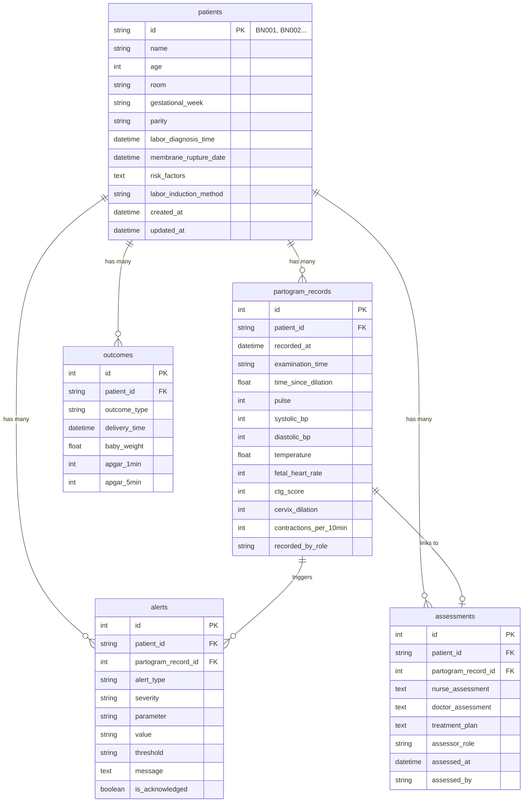

# 🗄️ Database Schema - Hệ thống Partogram Bệnh viện Hùng Vương

> **Database Engine**: SQLite (development) / PostgreSQL (production)  
> **ORM**: SQLAlchemy 2.0  
> **Migration**: Flask-Migrate (Alembic)

---

## Mục lục

- [Tổng quan Entity Relationship](#tổng-quan-entity-relationship)
- [Bảng patients](#bảng-patients)
- [Bảng partogram_records](#bảng-partogram_records)
- [Bảng assessments](#bảng-assessments)
- [Bảng alerts](#bảng-alerts)
- [Bảng outcomes](#bảng-outcomes)
- [Cấu hình Threshold](#cấu-hình-threshold)

---

## Tổng quan Entity Relationship

---

## Bảng `patients`

> Thông tin bệnh nhân sản khoa.

| Column | Type | Constraints | Mô tả |
|--------|------|------------|-------|
| `id` | `String(10)` | **PK** | Mã bệnh nhân (VD: BN001) |
| `name` | `String(100)` | NOT NULL | Họ tên |
| `age` | `Integer` | NOT NULL | Tuổi |
| `room` | `String(10)` | NOT NULL | Số phòng (VD: P301) |
| `gestational_week` | `String(20)` | NOT NULL | Tuổi thai |
| `parity` | `String(20)` | NOT NULL | Số lần sinh (VD: Para 0) |
| `labor_diagnosis_time` | `DateTime` | NOT NULL | Thời điểm chẩn đoán chuyển dạ |
| `membrane_rupture_date` | `DateTime` | NULLABLE | Ngày giờ ối vỡ |
| `risk_factors` | `Text` | NULLABLE | Yếu tố nguy cơ |
| `labor_induction_method` | `String(20)` | NULLABLE | Phương pháp (CDTN hoặc KPCD) |
| `created_at` | `DateTime` | DEFAULT `utcnow` | Thời điểm tạo |
| `updated_at` | `DateTime` | DEFAULT `utcnow`, AUTO UPDATE | Thời điểm cập nhật |

### Relationships

| Relationship | Target | Type | Cascade |
|-------------|--------|------|---------|
| `partogram_records` | `PartogramRecord` | One-to-Many | `all, delete-orphan` |
| `assessments` | `Assessment` | One-to-Many | `all, delete-orphan` |
| `outcomes` | `Outcome` | One-to-Many | `all, delete-orphan` |
| `alerts` | `Alert` | One-to-Many | *(backref only)* |

### Methods

| Method | Return | Mô tả |
|--------|--------|-------|
| `to_dict()` | `dict` | Serialize sang dictionary |
| `get_current_status()` | `str` | Trạng thái hiện tại (`normal`/`warning`/`critical`) |
| `get_last_check_time()` | `datetime\|None` | Thời điểm khám cuối |

---

## Bảng `partogram_records`

> Dữ liệu theo dõi chuyển dạ (Partogram). Đây là bảng core của hệ thống.

| Column | Type | Constraints | Mô tả |
|--------|------|------------|-------|
| **Identification** |
| `id` | `Integer` | **PK**, AUTO | ID tự tăng |
| `patient_id` | `String(10)` | **FK** → `patients.id`, NOT NULL | Mã bệnh nhân |
| `recorded_at` | `DateTime` | NOT NULL | Thời điểm ghi nhận |
| `examination_time` | `String(10)` | NULLABLE | Giờ khám (HH:MM) |
| `time_since_dilation` | `Float` | NULLABLE | Số giờ từ khi bắt đầu pha tích cực |
| **Chăm sóc hỗ trợ (Supportive Care)** |
| `companion` | `Boolean` | DEFAULT `False` | Có người thân đi kèm |
| `vas_score` | `Integer` | NULLABLE | Điểm đau VAS (1-10) |
| `drinking` | `Boolean` | DEFAULT `False` | Được uống nước |
| `eating` | `Boolean` | DEFAULT `False` | Được ăn |
| **Dấu hiệu sinh tồn mẹ (Mother's Vitals)** |
| `pulse` | `Integer` | NULLABLE | Mạch (bpm) |
| `systolic_bp` | `Integer` | NULLABLE | Huyết áp tâm thu (mmHg) |
| `diastolic_bp` | `Integer` | NULLABLE | Huyết áp tâm trương (mmHg) |
| `temperature` | `Float` | NULLABLE | Nhiệt độ (°C) |
| `urine` | `String(50)` | NULLABLE | Nước tiểu |
| **Theo dõi thai (Fetus Monitoring)** |
| `fetal_heart_rate` | `Integer` | NULLABLE | Nhịp tim thai (bpm) |
| `ctg_score` | `Integer` | NULLABLE | Điểm CTG (0=bình thường, 1=nghi ngờ, 2=bất thường, 3=bệnh lý) |
| `amniotic_fluid` | `String(50)` | NULLABLE | Tính chất nước ối |
| `fetal_position` | `String(50)` | NULLABLE | Ngôi thai |
| `caput` | `String(10)` | NULLABLE | Bướu huyết thanh |
| `molding` | `String(10)` | NULLABLE | Chồng xương sọ |
| **Tiến triển chuyển dạ (Labor Progress)** |
| `contractions_per_10min` | `Integer` | NULLABLE | Số cơn co/10 phút |
| `contraction_duration` | `Integer` | NULLABLE | Thời gian co (giây) |
| `cervix_dilation` | `Integer` | NULLABLE | Độ mở cổ tử cung (cm, 0-10) |
| `station` | `String(10)` | NULLABLE | Độ lọt |
| **Thuốc (Medication)** |
| `oral_medication` | `Text` | NULLABLE | Thuốc uống |
| `injection_medication` | `Text` | NULLABLE | Thuốc tiêm |
| `infusion_medication` | `Text` | NULLABLE | Thuốc truyền |
| **Đánh giá (Assessment)** |
| `nurse_assessment` | `Text` | NULLABLE | Nhận xét điều dưỡng |
| `doctor_assessment` | `Text` | NULLABLE | Nhận xét bác sĩ |
| `treatment_plan` | `Text` | NULLABLE | Kế hoạch điều trị |
| **Workflow** |
| `recorded_by_role` | `String(20)` | DEFAULT `'nurse'` | Vai trò người nhập (`nurse`/`doctor`) |
| `acknowledged_by_doctor_id` | `String(100)` | NULLABLE | Mã bác sĩ xác nhận |
| `acknowledged_at` | `DateTime` | NULLABLE | Thời điểm xác nhận |
| `doctor_signature` | `Text` | NULLABLE | Chữ ký bác sĩ (Base64 image) |
| `created_at` | `DateTime` | DEFAULT `utcnow` | Thời điểm tạo record |

---

## Bảng `assessments`

> Đánh giá và kế hoạch điều trị (lưu riêng, độc lập với partogram record).

| Column | Type | Constraints | Mô tả |
|--------|------|------------|-------|
| `id` | `Integer` | **PK**, AUTO | ID tự tăng |
| `patient_id` | `String(10)` | **FK** → `patients.id`, NOT NULL | Mã bệnh nhân |
| `partogram_record_id` | `Integer` | **FK** → `partogram_records.id`, NULLABLE | Liên kết record |
| `nurse_assessment` | `Text` | NULLABLE | Nhận xét điều dưỡng |
| `doctor_assessment` | `Text` | NULLABLE | Nhận xét bác sĩ |
| `treatment_plan` | `Text` | NULLABLE | Kế hoạch điều trị |
| `assessor_role` | `String(20)` | NOT NULL, DEFAULT `'doctor'` | Vai trò người đánh giá |
| `assessed_at` | `DateTime` | DEFAULT `utcnow` | Thời điểm đánh giá |
| `assessed_by` | `String(100)` | NULLABLE | Tên người đánh giá |

---

## Bảng `alerts`

> Cảnh báo tự động do hệ thống sinh ra khi chỉ số vượt ngưỡng.

| Column | Type | Constraints | Mô tả |
|--------|------|------------|-------|
| `id` | `Integer` | **PK**, AUTO | ID tự tăng |
| `patient_id` | `String(10)` | **FK** → `patients.id`, NOT NULL | Mã bệnh nhân |
| `partogram_record_id` | `Integer` | **FK** → `partogram_records.id`, NULLABLE | Record gây ra alert |
| `alert_type` | `String(20)` | NOT NULL | Loại: `"mother"` / `"fetus"` / `"labor"` |
| `severity` | `String(10)` | NOT NULL | Mức độ: `"normal"` / `"warning"` / `"critical"` |
| `parameter` | `String(50)` | NOT NULL | Chỉ số gây alert |
| `value` | `String(50)` | NULLABLE | Giá trị thực tế |
| `threshold` | `String(50)` | NULLABLE | Ngưỡng bị vượt |
| `message` | `Text` | NOT NULL | Thông báo cảnh báo (tiếng Việt) |
| `is_acknowledged` | `Boolean` | DEFAULT `False` | Đã xác nhận chưa |
| `acknowledged_at` | `DateTime` | NULLABLE | Thời điểm xác nhận |
| `acknowledged_by` | `String(100)` | NULLABLE | Người xác nhận |
| `created_at` | `DateTime` | DEFAULT `utcnow` | Thời điểm tạo |

### Giá trị `parameter`

| Parameter | Alert Type | Mô tả |
|-----------|-----------|-------|
| `pulse` | `mother` | Mạch |
| `systolic_bp` | `mother` | Huyết áp tâm thu |
| `temperature` | `mother` | Nhiệt độ |
| `ctg` | `fetus` | Điểm CTG |
| `fetal_heart_rate` | `fetus` | Tim thai |
| `cervix_dilation_rate` | `labor` | Tốc độ mở cổ tử cung |
| `contractions` | `labor` | Cơn co tử cung |

---

## Bảng `outcomes`

> Kết cục cuối cùng (kết quả sinh).

| Column | Type | Constraints | Mô tả |
|--------|------|------------|-------|
| `id` | `Integer` | **PK**, AUTO | ID tự tăng |
| `patient_id` | `String(10)` | **FK** → `patients.id`, NOT NULL | Mã bệnh nhân |
| `outcome_type` | `String(50)` | NOT NULL | Loại kết cục (Sinh thường, Mổ lấy thai...) |
| `outcome_details` | `Text` | NULLABLE | Chi tiết kết cục |
| `delivery_time` | `DateTime` | NULLABLE | Thời điểm sinh |
| `baby_weight` | `Float` | NULLABLE | Cân nặng bé (gram) |
| `baby_gender` | `String(10)` | NULLABLE | Giới tính |
| `apgar_1min` | `Integer` | NULLABLE | Điểm Apgar phút 1 (0-10) |
| `apgar_5min` | `Integer` | NULLABLE | Điểm Apgar phút 5 (0-10) |
| `complications` | `Text` | NULLABLE | Biến chứng |
| `notes` | `Text` | NULLABLE | Ghi chú thêm |
| `recorded_at` | `DateTime` | DEFAULT `utcnow` | Thời điểm ghi nhận |
| `recorded_by` | `String(100)` | NULLABLE | Người ghi nhận |

---

## Cấu hình Threshold

> Ngưỡng cảnh báo được định nghĩa trong class `ThresholdConfig` (không lưu DB, hardcoded trong code).

### Mother's Vital Signs

| Parameter | Min (Normal) | Max (Normal) | Warning | Critical |
|-----------|:---:|:---:|:---:|:---:|
| Mạch (bpm) | 60 | 100 | <60 or >100 | <50 or >120 |
| HA tâm thu (mmHg) | 90 | 140 | <90 or >140 | <80 or >160 |
| HA tâm trương (mmHg) | 60 | 90 | — | — |
| Nhiệt độ (°C) | 36.0 | 37.5 | >37.5 | >38.0 |

### Fetus Monitoring

| Parameter | Min (Normal) | Max (Normal) | Warning | Critical |
|-----------|:---:|:---:|:---:|:---:|
| Tim thai (bpm) | 110 | 160 | <110 or >160 | <100 or >180 |
| CTG Score | 0 | 1 | = 2 | ≥ 3 |

### Labor Progress

| Parameter | Ngưỡng | Mô tả |
|-----------|--------|-------|
| Tốc độ mở CTC | ≥ 0.5 cm/h | Đánh giá sau ≥ 2 giờ, so với record trước |

### Quy tắc tính Status tổng thể

1. **CTG ưu tiên tuyệt đối**: CTG ≥ 3 → `critical`, CTG = 2 → `warning`
2. **Đếm vi phạm**: Nếu có ≥1 `critical_violation` → `critical`
3. **Warning**: Nếu có ≥1 `violation` → `warning`
4. **Normal**: Không có vi phạm nào
